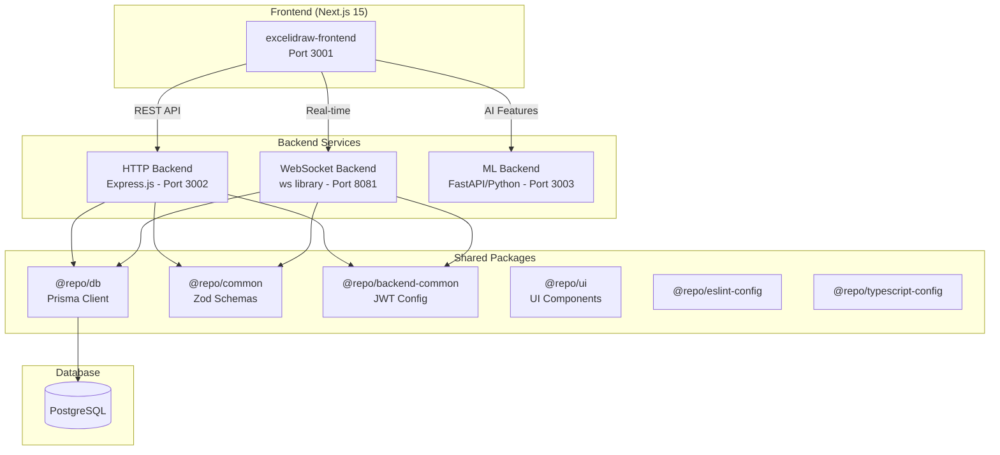
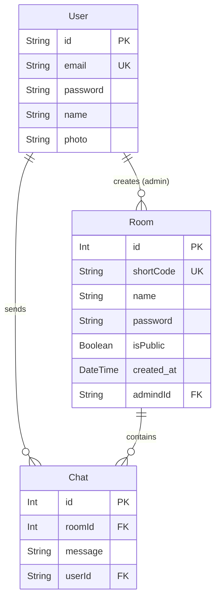
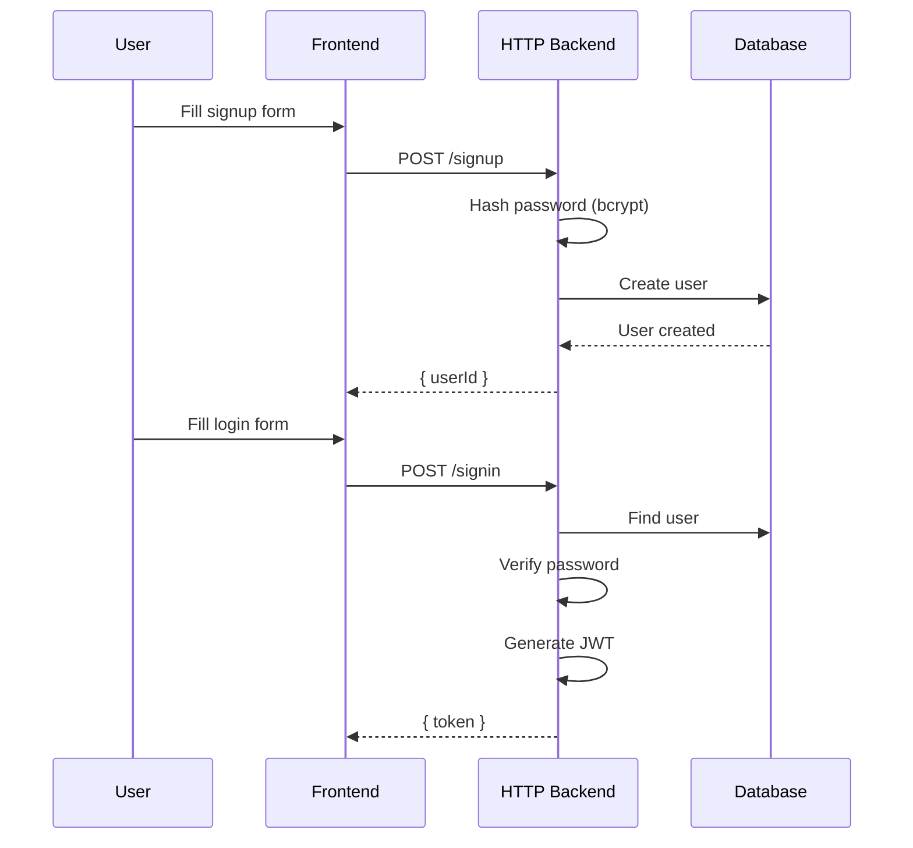
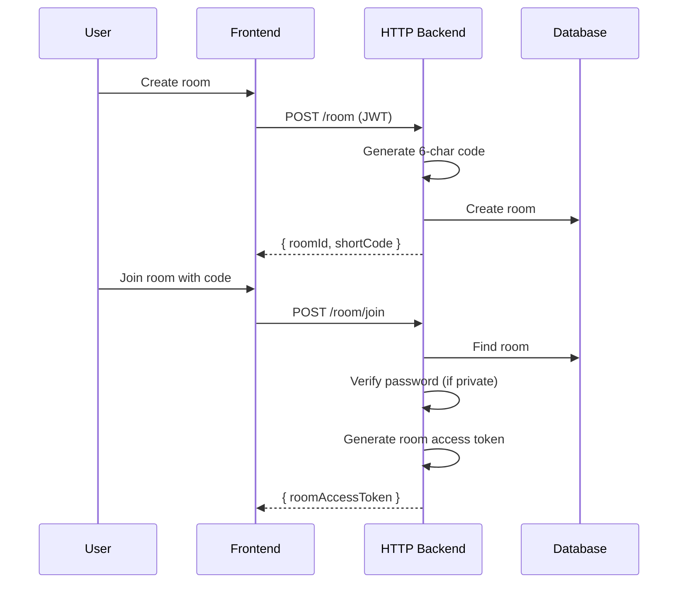
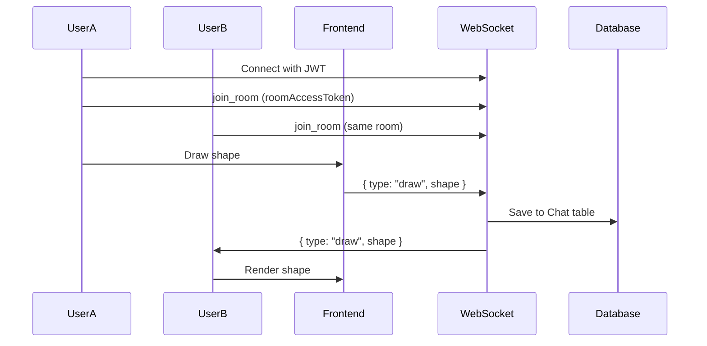

# DrawSync - Complete Architecture Walkthrough

##  Project Overview

**DrawSync** (also called ExcileDraw) is a **real-time collaborative whiteboard application** similar to Excalidraw. It allows multiple users to draw, sketch diagrams, and collaborate in real-time on a shared canvas with AI-powered features.

---

##  Architecture Overview

This is a **pnpm monorepo** powered by **Turborepo** for efficient builds and caching.



---

##  Directory Structure

```
Drawsync/
├── apps/                          # Application code
│   ├── excelidraw-frontend/       # Next.js 15 frontend (port 3001)
│   ├── http-backned/              # Express.js REST API (port 3002)
│   ├── ws-backend/                # WebSocket server (port 8081)
│   └── ml-backend/                # Python AI backend (port 3003)
│
├── packages/                      # Shared packages
│   ├── db/                        # Prisma ORM + PostgreSQL
│   ├── common/                    # Shared Zod validation schemas
│   ├── backend-common/            # Backend configuration (JWT secret)
│   ├── ui/                        # Shared UI components
│   ├── eslint-config/             # ESLint configuration
│   └── typescript-config/         # TypeScript configuration
│
├── package.json                   # Root package.json
├── pnpm-workspace.yaml            # Workspace definition
└── turbo.json                     # Turborepo configuration
```

---

##  Tech Stack

| Layer | Technology | Purpose |
|-------|------------|---------|
| **Frontend** | Next.js 15, React 19, TailwindCSS | UI and canvas rendering |
| **HTTP Backend** | Express.js, TypeScript | REST API for auth, rooms |
| **WebSocket Backend** | ws library, TypeScript | Real-time collaboration |
| **ML Backend** | Python, FastAPI, PyTorch, OpenCV, EasyOCR | AI features |
| **Database** | PostgreSQL + Prisma ORM | Data persistence |
| **Validation** | Zod | Schema validation |
| **Auth** | JWT + bcrypt | Authentication |
| **Build Tool** | Turborepo, pnpm | Monorepo management |

---

##  Database Schema

The database uses **PostgreSQL** with **Prisma ORM**:



### Key Points:
- **Users** can create multiple **Rooms**
- **Rooms** have a unique 6-character `shortCode` for easy sharing
- **Chat** stores drawing operations (shapes, edits, erases) as JSON messages
- Rooms can be **public** or **private** (password-protected)

---

##  Frontend (excelidraw-frontend)

**Location**: [apps/excelidraw-frontend](file:///Users/yasir/developer/Drawsync/apps/excelidraw-frontend)  
**Port**: 3001

### Pages Structure:
| Route | File | Purpose |
|-------|------|---------|
| `/` | [page.tsx](file:///Users/yasir/developer/Drawsync/apps/excelidraw-frontend/app/page.tsx) | Landing page |
| `/signup` | `app/signup/` | User registration |
| `/signin` | `app/signin/` | User login |
| `/room` | `app/room/` | Room management |
| `/canvas` | `app/canvas/` | Drawing canvas |
| `/ai-tools` | `app/ai-tools/` | AI features interface |

### Key Components:
| Component | Purpose |
|-----------|---------|
| [canvas.tsx](file:///Users/yasir/developer/Drawsync/apps/excelidraw-frontend/component/canvas.tsx) | Main drawing canvas (1000+ lines) - handles shapes, colors, undo/redo |
| [AITools.tsx](file:///Users/yasir/developer/Drawsync/apps/excelidraw-frontend/component/AITools.tsx) | AI feature integration |
| [RoomValidator.tsx](file:///Users/yasir/developer/Drawsync/apps/excelidraw-frontend/component/RoomValidator.tsx) | Room access validation |
| [DrawingIndicator.tsx](file:///Users/yasir/developer/Drawsync/apps/excelidraw-frontend/component/DrawingIndicator.tsx) | Shows who is drawing |
| [Roomcanvas.tsx](file:///Users/yasir/developer/Drawsync/apps/excelidraw-frontend/component/Roomcanvas.tsx) | Room-specific canvas wrapper |

### Service URLs (from [config.ts](file:///Users/yasir/developer/Drawsync/apps/excelidraw-frontend/config.ts)):
```typescript
Backend URL:     http://{hostname}:3002
WebSocket URL:   ws://{hostname}:8081
Room URL:        http://{hostname}:3000
Canvas URL:      http://{hostname}:3001/canvas
```

---

##  HTTP Backend (http-backend)

**Location**: [apps/http-backned](file:///Users/yasir/developer/Drawsync/apps/http-backned)  
**Port**: 3002

### REST API Endpoints:

#### Authentication
| Method | Endpoint | Purpose | Auth |
|--------|----------|---------|------|
| POST | `/signup` | Register new user |  |
| POST | `/signin` | Login, returns JWT |  |

#### Room Management
| Method | Endpoint | Purpose | Auth |
|--------|----------|---------|------|
| POST | `/room` | Create new room |  |
| POST | `/room/join` | Join room with code/password |  |
| GET | `/room/:shortCode` | Get room info |  |
| PUT | `/room/:shortCode` | Update room |  (admin only) |
| DELETE | `/room/:shortCode` | Delete room |  (admin only) |
| GET | `/my-rooms` | List user's rooms |  |

#### Chat/Drawing
| Method | Endpoint | Purpose | Auth |
|--------|----------|---------|------|
| GET | `/chats/:roomId` | Get room's drawing history |  |

### Key Features:
- **bcrypt** for password hashing
- **JWT** for authentication tokens
- **6-character short codes** for room sharing
- **Room access tokens** with 24-hour expiry

---

##  WebSocket Backend (ws-backend)

**Location**: [apps/ws-backend](file:///Users/yasir/developer/Drawsync/apps/ws-backend)  
**Port**: 8081

### Real-time Events:

#### Client → Server
| Event Type | Purpose |
|------------|---------|
| `join_room` | Join a drawing room |
| `leave_room` | Leave a room |
| `draw` | Create new shape |
| `edit_shape` | Modify existing shape |
| `erase` | Delete a shape |
| `chat` | Send message |
| `get_participant_count` | Request active user count |
| `user_activity` | Report user activity |

#### Server → Client
| Event Type | Purpose |
|------------|---------|
| `participant_count_update` | Updated user count |
| `draw` | New shape added |
| `edit_shape` | Shape modified |
| `erase` | Shape deleted |
| `chat` | New message |
| `user_activity_update` | User activity broadcast |
| `error` | Error notification |

### Key Features:
- **Room-based broadcasting** - messages only go to room participants
- **Debounced shape updates** - prevents spam during dragging (100ms debounce)
- **User drawing status tracking** - shows who is currently drawing
- **Automatic participant counting** - real-time active user count
- **Room access token validation** - secure room joining

---

##  ML Backend (ml-backend)

**Location**: [apps/ml-backend](file:///Users/yasir/developer/Drawsync/apps/ml-backend)  
**Port**: 3003

### AI Features:

| Feature | Endpoint | Description |
|---------|----------|-------------|
| **Shape Recognition** | `POST /ai/shape-recognition` | Convert rough sketches to clean shapes |
| **Diagram Detection** | `POST /ai/diagram-detection` | Detect diagram types (flowcharts, UML, etc.) |
| **Handwriting Recognition** | `POST /ai/handwriting-recognition` | OCR for handwritten text |
| **Diagram Suggestions** | `POST /ai/suggest-diagram` | AI-powered diagram recommendations |
| **Icon Suggestions** | `POST /ai/suggest-icons` | Context-aware icon recommendations |
| **Auto-Arrange** | `POST /ai/auto-arrange` | Organize messy drawings |
| **Complete Analysis** | `POST /ai/complete-analysis` | Run all AI features at once |

### Key Files:
| File | Purpose |
|------|---------|
| [main.py](file:///Users/yasir/developer/Drawsync/apps/ml-backend/src/main.py) | FastAPI endpoints |
| [ai_services.py](file:///Users/yasir/developer/Drawsync/apps/ml-backend/src/ai_services.py) | AI service implementations |
| [ml_services.py](file:///Users/yasir/developer/Drawsync/apps/ml-backend/src/ml_services.py) | ML model handling |
| [models.py](file:///Users/yasir/developer/Drawsync/apps/ml-backend/src/models.py) | Data models |

### Dependencies:
- OpenCV for computer vision
- EasyOCR for text recognition
- PyTorch for ML models
- scikit-learn for analysis

---

##  Shared Packages

### @repo/db
**Location**: [packages/db](file:///Users/yasir/developer/Drawsync/packages/db)

- Contains **Prisma schema** and client
- Exports `prismaClient` for database operations
- Schema: [schema.prisma](file:///Users/yasir/developer/Drawsync/packages/db/prisma/schema.prisma)

### @repo/common
**Location**: [packages/common](file:///Users/yasir/developer/Drawsync/packages/common)

Contains **Zod validation schemas**:
- `CreateUserSchema` - signup validation
- `SigninSchema` - login validation
- `CreateRoomSchema` - room creation
- `JoinRoomSchema` - room joining
- `UpdateRoomSchema` - room updates

### @repo/backend-common
**Location**: [packages/backend-common](file:///Users/yasir/developer/Drawsync/packages/backend-common)

- Exports `JWT_SECRET` for token signing
- Shared between HTTP and WebSocket backends

---

##  Data Flow

### 1. User Registration & Login


### 2. Room Creation & Joining


### 3. Real-time Drawing


---

##  Running the Project

### Requirements
- Node.js 18+
- pnpm 9.0.0
- Python 3.9+ (for ML backend)
- PostgreSQL database

### Commands

```bash
# Install dependencies
pnpm install

# Set up environment variables
# Create .env files with DATABASE_URL, JWT_SECRET

# Generate Prisma client
cd packages/db && npx prisma generate && npx prisma db push

# Run all services
pnpm dev

# Run individual services
pnpm --filter excelidraw-frontend dev    # Frontend: 3001
pnpm --filter http-backend dev           # HTTP API: 3002
pnpm --filter ws-backend dev             # WebSocket: 8081
pnpm --filter ml-backend dev             # ML: 3003
```

---

##  Environment Variables

| Variable | Used By | Purpose |
|----------|---------|---------|
| `DATABASE_URL` | db package | PostgreSQL connection string |
| `JWT_SECRET` | HTTP & WS backends | Token signing secret |
| `API_HOST` | ML backend | Server host |
| `API_PORT` | ML backend | Server port |
| `ENABLE_GPU` | ML backend | Enable CUDA acceleration |

---

##  Summary

DrawSync is a well-architected collaborative whiteboard with:

1. **Modern frontend** - Next.js 15 + React 19 + TailwindCSS
2. **Separated concerns** - REST API for CRUD, WebSocket for real-time
3. **AI capabilities** - Shape recognition, OCR, diagram detection
4. **Secure auth** - JWT + bcrypt + room access tokens
5. **Shared code** - Monorepo with reusable packages
6. **Type safety** - TypeScript + Zod validation throughout
